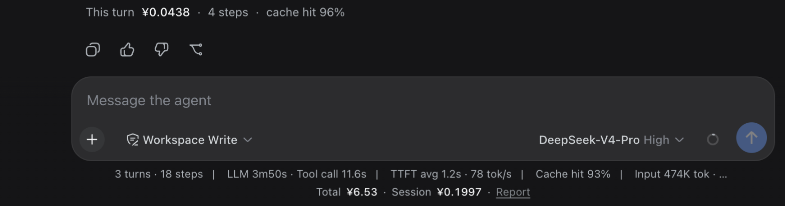
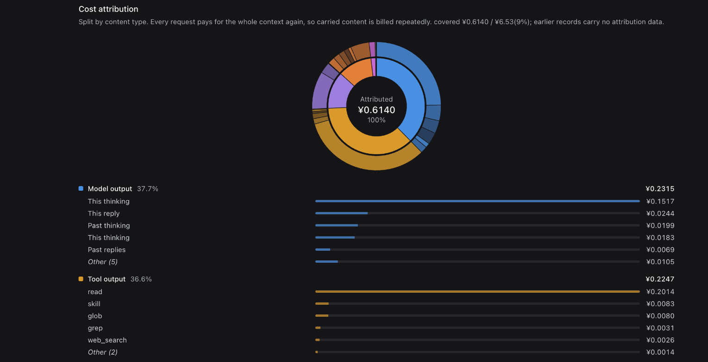

# dsh-bill

[English](README.md) | 中文

DSH(DeepSeek Harness)的费用统计插件。每轮对话下面看这轮花了多少,「费用」标签页看花在了什么上。





## 安装

```bash
dsh plugin --profile web add dsh-bill
```

重启 `dsh web` 生效。

## 功能

- **成本归因** —— 按内容类型拆分账单:工具输出、模型输出、系统提示词、终端命令(按 `git` / `pnpm` / `rg` 分组)、工具输入、附件、系统提醒、用户输入。旭日图可下钻。
- **每轮成本** —— 每个结束的轮次下面一行:这轮花了多少、几步、缓存命中率。数据来自会话日志本身,所以安装前的历史也有。
- **常驻显示** —— 官方统计条下方一行:总消耗、本会话、高峰占比;侧边栏显示今日花费与预算进度。四处界面可在设置里逐项关闭。
- **报告** —— 会话内的「费用」标签页(与 Chat / Trajectory 并列):总费用、Token、缓存命中、高峰占比、月度预测、账户余额;按模型 / 会话 / 用途(含上下文压缩等循环开销)拆分;每日趋势与周 × 小时热力图。
- **预算** —— 日 / 月 / 累计额度,超 80% 变黄,超支变红。
- **多币种** —— 实时汇率,约 166 种货币;各模型基础单价按其官方定价货币显示。
- **agent 工具** —— `bill_stats`,模型可直接回答花费相关的问题。
- 中英文跟随 DSH 语言设置;安装前的历史可从会话日志回填。

## 与同类插件的差异

三处实质差异:

**不用手编价格。** 其余插件都内置 2–4 个 DeepSeek 型号的价格表,换个 provider 就没有价格,因此它们都需要一个「手工编辑价格表」的入口。dsh-bill 通过 [`llm-pricing`](https://github.com/Jannchie/llm-pricing) 拉取 models.dev 与 OpenRouter,覆盖 8000+ 条目,新模型上线即可计价。

**价格是时间轴。** 其余插件把价格算成一个数存下来(或按当前价重算),厂商调价、跨越峰谷边界时历史就不准了。dsh-bill 按每次调用自己的时刻定价,历史永不重算。

**回答「花在什么上」。** 其余插件只回答「花了多少」——它们只消费 provider 汇总的 token 计数,不看请求内容。dsh-bill 在捕获时把请求切成分类片段,按缓存前缀位置分摊费用。

也有它们做得更好的地方:`usage-stats` 支持 11 种 provider 的余额与订阅额度(dsh-bill 只有 DeepSeek),`cost-meter` 能读取 OpenCode Go 的订阅配额,两者的常驻入口也比 dsh-bill 多。

<details>
<summary>逐项对比(按源码实测,取样于 2026-08-16)</summary>

取样为 GitHub `dsh-plugin` topic 下 star ≥ 40 的费用类插件,以及 npm 上已发布的四个。`deepseek-harness-wallet` 等 star 较低的插件未逐一核对。

| | dsh-bill | cost-meter | usage-stats | dsh-cost | cost-log | dsh-usage | usage-billing |
| --- | --- | --- | --- | --- | --- | --- | --- |
| star / 版本 | — | ★42 / 1.3.1 | ★40 / 0.2.0 | ★3 / 0.2.1 | ★2 / 1.0.0 | ★2 / 0.1.1 | 0.2.2 |
| 价格来源 | 在线目录 | 内置表 + 手动爬文档页 | 不计价 | 内置表 | 内置表 | 用户自填 | 内置表 |
| 覆盖模型 | 8000+ 条目 | 4 个 DeepSeek | — | 4 个 DeepSeek | 2 个 DeepSeek | 逐个手填 | DeepSeek |
| 未收录模型 | 标记不计入 | 按 flash 价计 | 标记未知 | 按 v4-pro 计 | 标记 `≈` | 标记 `--` | 计 0 |
| 历史不被重算 | ✓ | ✗ | — | ✗ | ✓ | ✓ | 需手动回填 |
| 内容归因 | ✓ | ✗ | ✗ | ✗ | ✗ | ✗ | ✗ |
| 成本预测 | ✓ | ✗ | ✗ | ✗ | ✗ | ✗ | ✗ |
| 预算 | ✓ | ✓ | ✗ | ✗ | ✗ | ✗ | ✗ |
| 账户余额 | ✓ | ✓ | ✓ | ✓ | ✗ | ✗ | ✗ |
| 安装前历史 | ✓ | ✗ | ✓ | ✗ | ✓ | ✓ | ✓ |
| agent 工具 | ✓ | ✗ | ✗ | ✗ | ✗ | ✗ | ✓ |
| 多币种 | 166 种,实时汇率 | 3 种,固定汇率 | — | 随界面语言 | ¥/$ | 单一货币 | 仅 ¥ |

</details>

## 计价

- models.dev + OpenRouter 双目录,24h 缓存并落盘,失败回退内置历史快照;
- DeepSeek 官方直连价覆盖目录报价,按调用时刻自动选择峰谷价;
- 模型名归一化,匹配不到的标记为「?」,不参与合计 —— 不估算;
- `priceOverrides` 可覆盖或新增任意价格(通常用不到)。

## 归因方法

每次请求都要为完整上下文重新付费,因此一次读入的工具输出会在后续每次请求中继续计费,直到滑出上下文。归因逐请求计算后累加。

两个关键点:

- **按位置定价。** 前缀缓存下,prompt 的前 N 个 token 走缓存价,其余走全价 —— DeepSeek 上两者相差最多 156×。内容片段严格按 provider 接收顺序排列,缓存前缀按缓存价计,仅尾部付全价。按平均单价分摊会把费用记到错误的类别上。
- **只保留计数。** 归因在捕获时对实时请求完成,落盘仅保存各类别金额,不保存任何 prompt 文本。

各片段的 token 数按字符占比估算(provider 只返回总数),总额取真实计费值,因此各项精确加总到实付金额。

会话日志里只有 token 计数与模型路由,**没有请求正文** —— 所以安装前的历史能回填出费用,但**归因无法追溯**。报告会标注已覆盖比例。

## 配置

预算、预算货币,以及四处界面各自是否显示,都在设置里的「费用统计」页设定,存于 `$DSH_HOME/dsh-bill/prefs.json`。(不走 DSH 自己的设置文档:它的 API 代理只向浏览器暴露一份固定的命名空间白名单,插件的命名空间在那里既读不到也写不了。)

`maxRecords`(内存环形缓冲条数,默认 20000)与 `priceOverrides` 走插件配置,会在启动时校验 —— 写错的字段会指名报错,而不是让报告静静地空掉。`~/.dsh/profiles/web/cordis.patch.yml` 只在需要覆盖价格时才用得上:

```yaml
- insert:
    - id: bill
      name: 'dsh-bill'
      config:
        priceOverrides:
          'anthropic/claude-sonnet-4-6':
            inputPerM: 3.0        # 每百万 token 输入(未命中),USD
            outputPerM: 15.0
            cacheReadPerM: 0.3
            cacheWritePerM: 3.75
```

## 数据与隐私

- 记录每次调用的 provider / model / token 用量及归因金额,落盘至 `$DSH_HOME/dsh-bill/records.jsonl`(2 万条环形缓冲,更早的折叠为汇总);
- 账户余额的 API key 在 host 侧解析与使用,不进入浏览器;
- 除价格目录、汇率接口与余额查询外不发送任何数据;不保存任何对话内容。

## 实现

| 层 | 实现 |
| --- | --- |
| 捕获 | 监听 `llm/stream` waterfall,包装流观察 `usage` chunk,原样透传 |
| 计价 | 按调用时刻交由 `llm-pricing` 解析目录 / 峰谷 / 覆盖价 |
| 归因 | 捕获时切分请求为分类片段,按缓存前缀位置分摊 |
| 回填 | 扫描会话日志导入未记录的会话,按 `turn:step` 去重 |
| 每轮 | `billTurns` session projection:host 侧折叠会话日志,推送到客户端,无轮询 |
| 存储 | 内存环形缓冲 + 追加式 JSONL,淘汰前折叠为汇总;偏好为单独的小 JSON 文档;原子替换与文件锁复用 `dsh-atomic-write` |
| 传输 | 优先 `ctx.connection.rpc` 通道 `/dsh-bill`,回落 `POST /dsh-bill/api` |
| UI | `conversation.view` / `conversation.chat.turnTail` / `conversation.composer.dock` / `sidebar.footer.action` / `settings.section`,全部构建在 host 的 `--dsw-*` 设计令牌之上 |

## License

MIT
