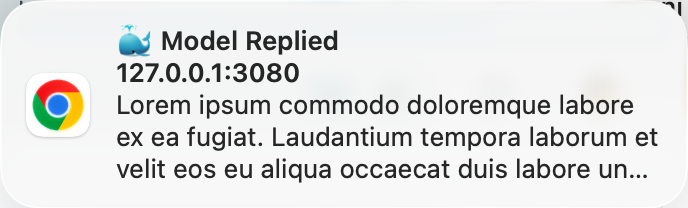

# dsh-web-notification

[English](README.md) | 简体中文

大模型在 DeepSeek Harness Web UI 中完成一次回复时，弹出一条系统级 Web Notification（页面聚焦与否都会弹）。

## 功能特性

- 每轮回复完成 → 弹系统通知：标题为 `🐳 Model Replied`，正文为该轮用户消息
  - 用户消息不可用时回退到会话标题
- 启动时 + 首次用户手势时自动请求通知权限（兼容 Safari 的手势要求）
- 同一轮回复去重，不会重复弹
- 无 UI 侵入：不注入任何界面元素

## 截图



## 工作原理

- **检测**：客户端监听**所有已打开会话**的 snapshot `turnEnds`（`Map<turn, endSeq>`），turn 数增长 = 该会话一轮回复完成——多个会话并行回复时各自独立触发通知；同时从 `chat` 节点取触发本轮回复的用户消息文本。
- **显示**：每条通知唯一 tag（`dsh-reply-done-<sessionId>-<turn>`）+ `renotify: true`。相同 tag 是"替换"语义，上一条还显示时替换通知在 macOS/Chrome 上不会重新弹横幅。
- **打包**：`build.mjs` 把 `src/client/index.js` 包进 `window.__ModuleLoader__.load({ id, factory })` 握手外壳，由浏览器端模块表执行。

---

## 安装（用户）

前置要求：已安装 `dsh`（`npx @deepseek-ai/dsh`）并初始化过 web profile。

```sh
# 1. 安装组合包
npx @deepseek-ai/dsh plugin --profile web add https://github.com/2h0n/dsh-web-notification/archive/refs/tags/v0.1.0.tar.gz

# 2. 重启
npx @deepseek-ai/dsh web
```

验证：浏览器控制台无 `dsh-web-notification` 报错；同一会话连发两条消息，两条回复各弹一条通知；再次重启插件仍在。

> - `npx @deepseek-ai/dsh plugin --profile web add` 把参数转发给 profile 目录内的 pnpm，并因包声明了 `dsh.bundle` 自动把它追加进 `dsh.profile.bundles`；若绕过它直接 `pnpm add`，则需手动补上 bundles 条目。
> - 若安装报 `ERR_PNPM_TARBALL_INTEGRITY`（profile 里其他移动分支依赖的锁文件校验和过期），先执行 `pnpm install --update-checksums` 再重试。

## 开发（开发者）

### 环境要求

- Node.js 22.19+ 或 24+（与 DeepSeek Harness 官方支持一致；构建零依赖，无需安装任何 npm 包）

### 目录结构

```
dsh-web-notification/
├── package.json          # manifest（元数据清单）：exports + dsh.bundle.patch + dsh.client
├── cordis.patch.yml      # patch 条目（插件行），由 dsh.bundle.patch 引用
├── dsh.plugin.json       # 插件清单
├── build.mjs             # 构建脚本（零依赖）
├── src/
│   ├── index.js          # 插件入口（Node 端）：空入口（无宿主逻辑）
│   └── client/index.js   # 客户端插件（浏览器端）：全部逻辑（唯一需要改的文件）
└── lib/                  # 构建产物（勿手改，由 build.mjs 生成）
    ├── index.js
    └── client.js         # __ModuleLoader__ 握手格式的浏览器 bundle
```

### 本地开发调试

官方方式：把本地 checkout 直接装进 profile（`npx @deepseek-ai/dsh plugin add` 会链接目录并自动登记 bundles）：

```sh
# 1. 构建
node build.mjs

# 2. 安装本地 checkout
npx @deepseek-ai/dsh plugin --profile web add "$PWD"

# 3. 重启
npx @deepseek-ai/dsh web
```

不方便跑 pnpm 时，也可以手动链接（结果等价）：

```sh
ln -s "$PWD" ~/.dsh/profiles/web/node_modules/dsh-web-notification
# 并手动编辑 ~/.dsh/profiles/web/package.json：
#   dependencies:        "dsh-web-notification": "file:$PWD"
#   dsh.profile.bundles: 追加 "dsh-web-notification"
```

修改逻辑后的迭代流程（符号链接，无需重新安装）：

```sh
node build.mjs        # 重新生成 lib/
npx @deepseek-ai/dsh web   # 重启（file: 符号链接，无需重新安装）
```

### 移除

官方方式（同时移除依赖和对应的层）：

```sh
npx @deepseek-ai/dsh plugin --profile web remove dsh-web-notification
```

手动链接安装的，反向操作即可：

```sh
rm ~/.dsh/profiles/web/node_modules/dsh-web-notification
# 并手动编辑 ~/.dsh/profiles/web/package.json：
#   从 dependencies 与 dsh.profile.bundles 中删除 dsh-web-notification
```

移除后重启 `npx @deepseek-ai/dsh web` 生效。


## License

MIT
